# bioSyntax
Syntax highlighting for computational biology file formats in Sublime Text 3, gtksourceview / gedit (in progress) and vim (in future).

## Contents
[**Sublime Text 3**](#sublime-text-3-installation)
- [fasta](#fasta-fa-faa-fasta)
- [fastq](#fastq-fq-fastq)
- [SAM](#sam-sam)
- [Wig](#wig-wig)
- [Bed](#bed-bed)
- [PDB](#pdb-pdb)
- [GTF](#gtf-gtf)
- [VCF](#vcf-vcf)
- [Installation Instructions](#installation-instructions)

[**Gedit**](#gedit-installation)
- [fasta](#fasta-fa-fasta)
- [fastq](#fastq-fq-fastq-alpha)
- [bed](#bed-bed-alpha)
- [Installation Instructions](#installation-instructions-linux)

## Sublime Text 3 Installation

## Fasta (.fa; .faa; .fasta)
A total of 6 formats available:
- [fasta.sublime-syntax](syntax/sublime/fasta.sublime-syntax): Context-dependent; able to detect if fasta file contains nucleotides or amino acids (Recommended).

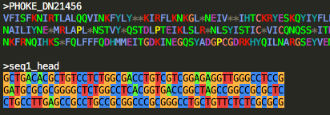

- [fasta-nt.sublime-syntax](syntax/sublime/fasta-nt.sublime-syntax): for .fa & .fasta files only, specifically for highlighting RNA bases. High-contrast colour scheme with background highlighting.

- [fasta-clustal.sublime-syntax](syntax/sublime/fasta-clustal.sublime-syntax): High-contrast amino acid highlighting.

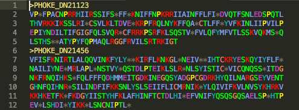

- [fasta-zappo.sublime-syntax](syntax/sublime/fasta-zappo.sublime-syntax): Residues are coloured according to their physico-chemical properties. Details can be found at [Jalview](http://www.jalview.org/version118/documentation.html#zappo).

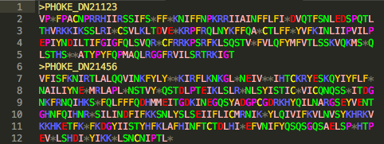

- [fasta-taylor.sublime-syntax](syntax/sublime/fasta-taylor.sublime-syntax): Details can be found on [Jalview](http://www.jalview.org/version118/documentation.html#taylor).

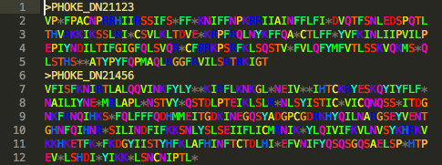

- [fasta-hydro.sublime-syntax](syntax/sublime/fasta-hydro.sublime-syntax): Residue highlighting according to a [hydrophobicity table]()http://www.jalview.org/version118/documentation.html#hydrophobicity, ranging between red and blue, where red is the most hydrophobic residue and blue is the most hydrophilic residue.

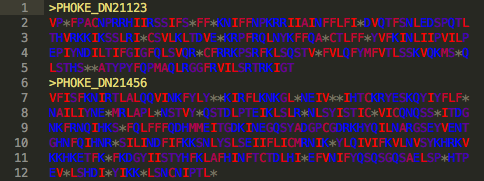

## Fastq (.fq; .fastq)
[fastq.sublime-syntax](syntax/sublime/fastq.sublime-syntax):

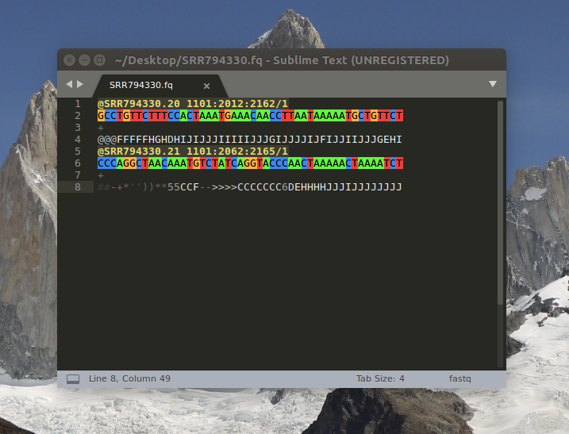

## SAM (.sam)
[sam.sublime-syntax](syntax/sublime/sam.sublime-syntax):

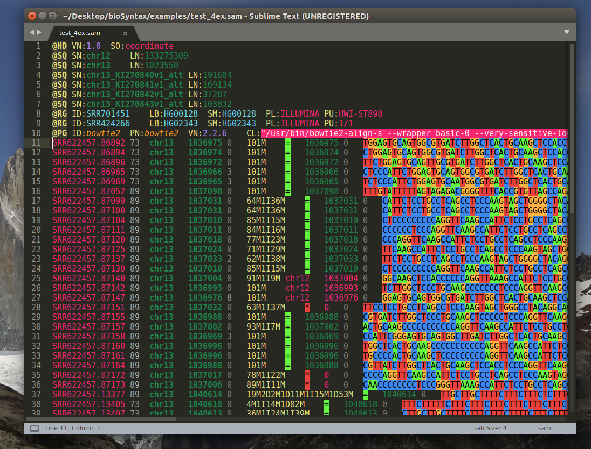

## Wig (.wig)
[wig.sublime-syntax](syntax/sublime/wig.sublime-syntax):

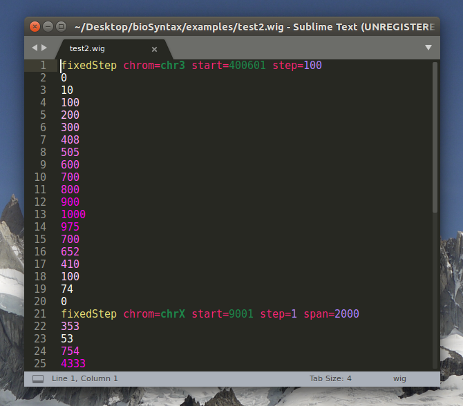

## Bed (.bed)
[bed.sublime-syntax](syntax/sublime/bed.sublime-syntax):

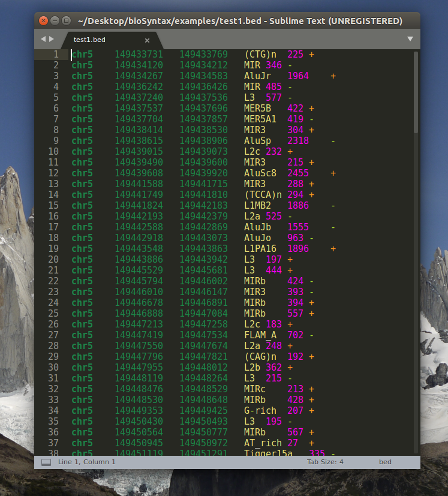

## PDB (.pdb)
[pdb.sublime-syntax](syntax/sublime/pdb.sublime-syntax):

## GTF (.gtf)
[bed.sublime-syntax](syntax/sublime/bed.sublime-syntax):

## VCF (.vcf)
[vcf.sublime-syntax](syntax/sublime/vcf.sublime-syntax):

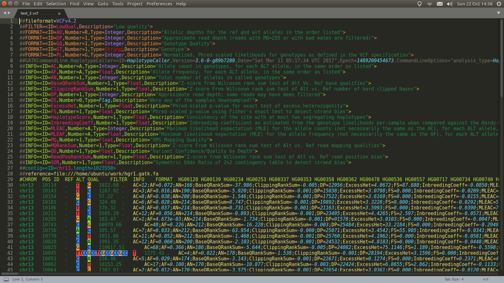

## Installation Instructions

1. Download the [bioMonokai Color Scheme](theme/sublime/Color\ Scheme\ -\ bioSyntax.sublime-package).
2. Copy it to your Sublime Text application packages folder:
- **Linux**: `../sublime_text_3/Packages/`
- **Windows**: `C:/Program Files/Sublime Text 3/Packages/`
- **Mac**: `/Applications/Sublime Text.app/Contents/MacOS/Packages/`
3. Download any of the syntax highlighting files that you want from the links above.
4. Copy them into the Sublime Text Packages folder:
- **Linux**: `~/.config/sublime-text-3/Packages/User`
- **Windows**: `%APPDATA%/Roaming/Sublime Text 3/Packages/`
- **Mac**: `/Users/[username]/Library/Application Support/Sublime Text 3/Packages/`
5. Open Sublime Text and go to Preferences > Color Scheme > bioMonokai
6. At the bottom-right corner of the Sublime Text window, click the file type (e.g. Plain Text) to open the drop down menu. Scroll to and select the file format you are using.

You now have pretty formats!

## Gedit Installation

## Fasta (.fa; .fasta)
Highlights nucleotide sequence by base. Colors match IGV representations using the Jalview palette.

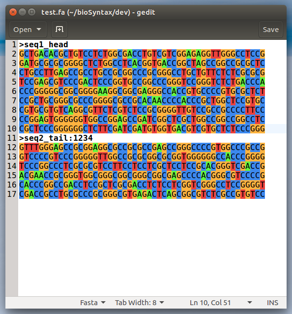

## Fastq (.fq; .fastq) [alpha]
Colors headers and nucleotides. Still abit buggy but can be worked out.

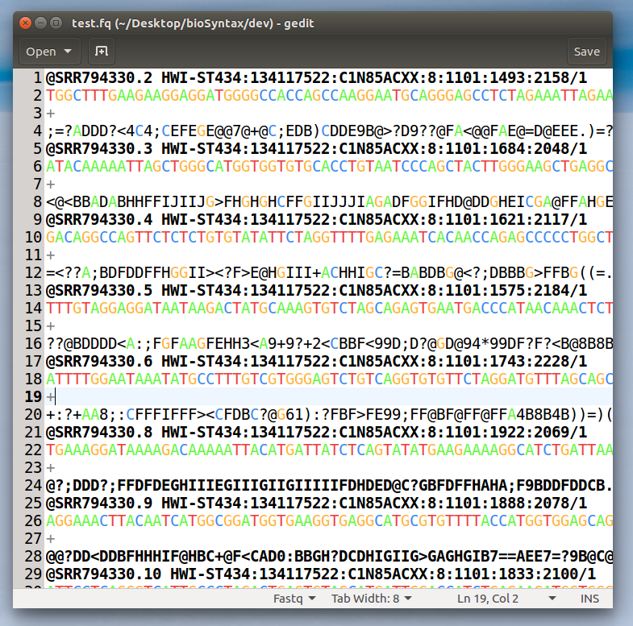

## Bed (.bed) [alpha]
View bed files with colors based on columns.

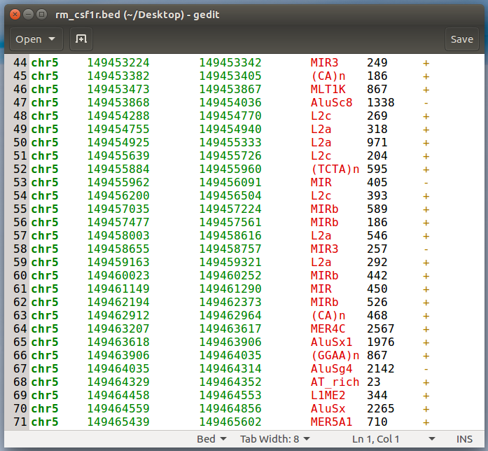

## Installation Instructions (Linux)
1. Download the respective `*.lang` files you're interested in
2. Download the `bioKate.xml` style scheme
 
3. Change permissions to all readonly
	`chmod 0644 *.lang`

4. Copy the `bioKate.xml` style scheme to gtksoureview style folder
	`sudo cp bioKate.xml /usr/share/gtksourceview-3.0/styles/bioKate.xml`

5. Copy the `*.lang` file(s) to gtksourceview language spec folder
	`sudo cp fasta.lang /usr/share/gtksourceview-3.0/language-specs/fasta.lang`

6. Restart `gedit` and you should have pretty formats 

