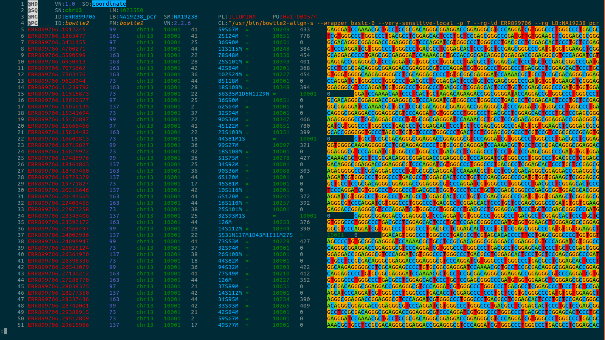

Syntax highlighting for computational biology in `vim`, `less`, `sublime3` & `gedit`.

Contributors: [Artem Babaian](https://github.com/ababaian) \| [Eric Chu](https://github.com/echu113) \| [Anicet Ebou](https://github.com/ebedthan) \|

[Alyssa Fegen](https://github.com/alyeffy) \| [Jeffrey Kam](https://github.com/lazypanda10117) \| [Gherman Novakovskiy](https://github.com/fransilvion) \| [Jasper Wong](https://github.com/Jwong684)

[A hackseq17 project.](https://www.hackseq.com)

### [Watch the hackseq17 presentation (~5 min)](https://youtu.be/dHYN3E7edhY?t=6m28s)

## Installation (alphas)

### Sublime Text 3 Installation

1. Download the [bioMonokai Color Scheme](https://github.com/ababaian/bioSyntax/blob/master/dev/theme/sublime/Color%20Scheme%20-%20bioSyntax.sublime-package).
2. Copy it to your Sublime Text application packages folder:
- **Linux**: `../sublime_text_3/Packages/`
- **Windows**: `C:/Program Files/Sublime Text 3/Packages/`
- **Mac**: `/Applications/Sublime Text.app/Contents/MacOS/Packages/`
3. Download the [bioSyntax sublime package](syntax/bioSyntax_sublime_RELEASE.zip).
4. Unzip the `*.sublime-syntax` files into the Sublime Text Packages folder:
- **Linux**: `~/.config/sublime-text-3/Packages/User/`
- **Windows**: `%APPDATA%/Roaming/Sublime Text 3/Packages/`
- **Mac**: `/Users/your_username/Library/Application Support/Sublime Text 3/Packages/`
5. Open Sublime Text and go select the bioSyntax (bioMonokai) theme
`Preferences > Color Scheme > bioMonokai`
6. Formats should auto-detect; you can select a specific syntax at the drop-menu at the bottom-right corner of the window (e.g. Plain Text)

You now have pretty formats!

### Gedit Installation (Linux)
1. Download the respective `*.lang` files you're interested in
2. Download the `bioKate.xml` style scheme
 
3. Change permissions to all readonly
	`chmod 0644 *.lang`

4. Copy the `bioKate.xml` style scheme to gtksoureview style folder
	`sudo cp bioKate.xml /usr/share/gtksourceview-3.0/styles/bioKate.xml`

5. Copy the `*.lang` file(s) to gtksourceview language spec folder
	`sudo cp fasta.lang /usr/share/gtksourceview-3.0/language-specs/fasta.lang`

6. Restart `gedit` and select the bioSyntax theme
	`Edit > Preferences > Font & Color > bioKate'`
7.  You now have pretty formats 

